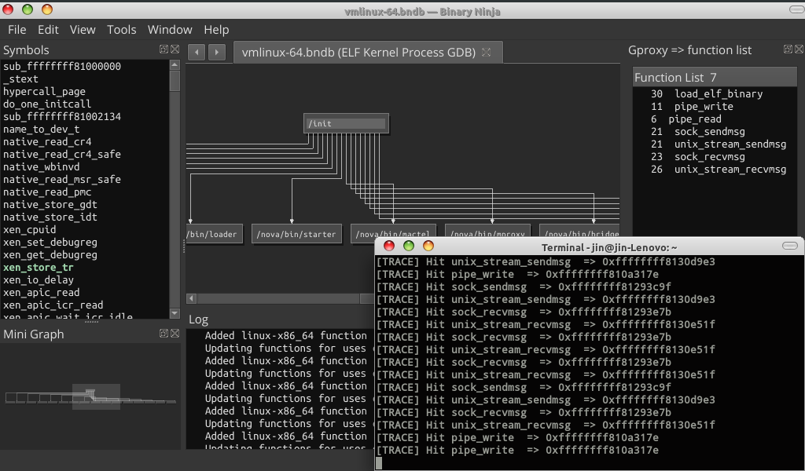

Bridge gdb, binaryninja and angr for binary analyses



Youtube Demo 1
[](https://m.youtube.com/watch?v=GSqoDsAwt-Y)

Youtube Demo 2 (real target)
[](https://m.youtube.com/watch?v=qLTcykEyN0I)


# Requirenment
```
binaryninja 2.0...
gdb 9
angr 9.2.102
```

# Usage
```
1). copy this directory in binaryninja plugin path
2). gdb ./a.out
    (gdb) source /gproxy/gdbinit.py
3). start server in binaryninja: Tools > gproxy > start server

mencocokan alamat gdb ke binaryninja
(gdb) b main
(gdb) run
(gdb) info proc mappings 
          Start Addr           End Addr       Size     Offset objfile
      0x555555554000 

4). binaryninja: file > rebase > 0x555555554000
```

# Tips
Start server setelah address di binaryninja di rebase.<br>

Menyamakan binaryninja dan angr:
```python

hex(state.project.loader.main_object.mapped_base)


```
ANGR baseaddress misal mengikuti GDB:
```python

proj = angr.Project(bv.file.filename, main_opts={'base_addr': 0x555555554000})
state = proj.factory.entry_state(stdin=angr.SimFile)

```


Test step state for branch
```python


import angr
proj = angr.Project(bv.file.filename)
state = proj.factory.entry_state(stdin=angr.SimFile)
simgr = proj.factory.simgr(state)
while len(simgr.active) == 1:
	simgr.step()


```

After import Angr and generate state in console paste this for UI consumer
```python


from gproxy.data_global import GLOBAL, SIGNALS

GLOBAL.simgr = simgr
SIGNALS.state_updated.emit()


```

# Cheatshet
Update realtime in UI
```python


import angr
from gproxy.data_global import GLOBAL, SIGNALS

proj = angr.Project(bv.file.filename)
state = proj.factory.entry_state(stdin=angr.SimFile)
simgr = proj.factory.simgr(state)
while len(simgr.active) == 1:
    simgr.step()
    GLOBAL.simgr = simgr
    SIGNALS.state_updated.emit()


```

Explore, this pararel step for active stash
```python

simgr.explore(find=0x123)
simgr.explore(find=0x123, avoid=0x777) #menghindari 0x777

#Mencari ketika input stdin menghasilkan password benar
simgr.epxpore(find=lambda s: b"Access granted" in s.posix.dumps(0) )

#Menghindari pesan kesalahan di stdout
simgr.explore(avoid=lambda s: b"Wrong password" in s.posix.dumps(1) )

#Brute force password
simgr.explore(find=lambda s: b"Success" in s.posix.dumps(1), avoid=lambda s: b"Fail" in s.posix.dumps(1) )

#show status explore
import logging
logging.getLogger('angr').setLevel('INFO')

#Note: dump(fd) 0=stdin 1=stdout 2=stderr

```

Symbion mode, sample packed_elf64 malware

```python

import subprocess
import os
import nose
import avatar2 as avatar2
import angr
import claripy
from angr_targets import AvatarGDBConcreteTarget
from gproxy.data_global import GLOBAL, SIGNALS

avatar_gdb = AvatarGDBConcreteTarget(avatar2.archs.X86_64, "127.0.0.1", 1234) #other terminal $ gdbserver :1234 ./packed_elf64
p = angr.Project(bv.file.filename, concrete_target=avatar_gdb, use_sim_procedures=True)

entry_state = p.factory.entry_state()
entry_state.options.add(angr.options.SYMBION_SYNC_CLE)
entry_state.options.add(angr.options.SYMBION_KEEP_STUBS_ON_SYNC)
simgr = p.factory.simgr(entry_state)

GLOBAL.simgr = simgr
SIGNALS.state_updated.emit()

simgr.use_technique(angr.exploration_techniques.Symbion(find=[0x85b853]))
exploration = simgr.run()

GLOBAL.simgr = simgr
SIGNALS.state_updated.emit()

new_concrete_state = exploration.stashes['found'][0]

for i in range(0,4):
     simgr = p.factory.simgr(new_concrete_state)
     simgr.use_technique(angr.exploration_techniques.Symbion(find=[0x85b853]))
     exploration = simgr.run()
     new_concrete_state = exploration.stashes['found'][0]

GLOBAL.simgr = simgr
SIGNALS.state_updated.emit()

simgr = p.factory.simgr(new_concrete_state)
simgr.use_technique(angr.exploration_techniques.Symbion(find=[0x400cd6]) )

exploration = simgr.run()
GLOBAL.simgr = simgr
SIGNALS.state_updated.emit()

# kode yang dikaburkan

state1 = simgr.found[0]
addr = state1.addr
data = state1.memory.load(addr, 0x100)
raw = state1.solver.eval(data, cast_to=bytes)

import capstone
from capstone import Cs, CS_ARCH_X86, CS_MODE_64
md = Cs(CS_ARCH_X86, CS_MODE_64)

for i in md.disasm(raw, addr):
    print("0x%x:\t%s\t%s" % (i.address, i.mnemonic, i.op_str))

# atau load ke binaryninja hasil raw
bv.add_user_segment(addr, len(raw), 0, len(raw), SegmentFlag.SegmentReadable | SegmentFlag.SegmentExecutable)
bv.write(addr, raw)
bv.add_function(addr)

```

# Tips visualisasi semua proses linux
Untuk refresh visual proses linux, klik simbol di sidebar dan
lihat juga di sidebar function list berapa kali hook load_elf_binary di HIT
yang menandakan jumlah proses baru saat os baru boot.


# Tips dynamic hook (monitoring data) analysis
Jika alamat target misal lokasi struktur ada di tengah fungsi
anda bisa set alamat di /tmp/funcs.txt alias merubah offset symbol addr.
otomatis jika klik kanan di function list dia pakai alamat ini.

Saat pakai tombol pause lalu play, harus manual alias continue di gdb langsung
untuk melanjutkan.
NOTE: Untuk dump structure hanya update saat ini bukan berasal dari history register.

# dump value variable local
1). dump seluruh frame:
x/64gx $rsp
x/64gx $rbp-0x100


# Utilitis for mikrotik helper
Open console binaryninja and paste this, this script by https://github.com/tenable/routeros

1). find handlers
```python
from gproxy.helpers import Mikrotik
aa = Mikrotik()
aa.target = "/media/jin/4abb279b-6d65-4663-97c2-26987f64673a/home/yuna/Lab/DockerImage-mikrotik/modif/npk-routeros/bak/6.42.11/nova/bin/"
aa.find_handlers()

```
output, copy all to csv file filter with [1/79] user... etc
NOTE: this is very slow because bn analysis all. and fix it hex result from int
```
[0/79] kidcontrol
kidcontrol,0,0,0
[1/79] user
user,0,0,0,0,0,0,0,0
[2/79] ping
[3/79] convertbr
[4/79] keyman
[5/79] modprobed
modprobed,1
[6/79] telser
[7/79] licupgr

```

# Trace function basic block
```
1. open bn > view > block list

2. (gdb) cmdtracefunc generate
   (gdb) cmdtracefunc run-bn
   (gdb) c

3. right click in function list > generate block
         wait breakpoint
   (gdb) cmdtracefunc run-bn-block
   (gdb) c

NOTE: for update view, double click in function list

View desc:
[4/18] sub_xxx
    3 0x123 => start-block
    7 0x777 => end-block

[hit/count_hit]
    3 => berapa kali dipanggil   
```


# Frida function trace
```
$ python fridainit.py
>> Select target? Linux/Android (l/a): a
>> remote ip: 192.168.43.1
>> Chose pid? (1234): 9144
>> em
>> et
```

Cheatshet frida patch
```
# enumerate JNI function (ident with "Java_")
$ frida-trace -i "Java_*" com.android.tes

# enumerate all function by module
$ frida-trace -I "openssl_mybank.so" com.android.tes
```

example case:
```
	=====================
	 Fuzzer proxy v2.0.0
	=====================

>> Select target? Linux/Android (l/a): a
>> Chose pid? (1234): 5843

[+] Inject Agent successfully

==============
 List Command:
==============
1. shell/reverse_shell_java (s/js)
2. enum_module/enum_symbol/enum_thread (em/es/et)
3. trace (tr)> (all/<symbol>/back)> (all/mnemonic(ret,jne)/<enter-none>)
4. stalker (stl)> (back/<id>/window/intruksi/stoplivethread/startlivethread)
           (intruksi)> <func_addr>
5. exit

>> tr
[+] Getting modules...
[+] Send to binja...
[+] Done.

>> Module> png_read
[+] Getting symbols to hook...

>> png_read> symbol> parse_png_file

>> png_read> parse_png_file> Stalking filter> ret
[+] hook: parse_png_file intruction filter: ret
[+] Setup hook: parse_png_file with stalking: ret
[+] Done.

>> exit
NOTE: >1 filter di pencarian hanya fungsi ter hit

```

#Tips hook addr dengan base dan offset dari binja (striped binary)
```
$ python
>> 0x7ff2232323 + 0x510 #base_module+offset

$ python fridainit.py
>> png_read> symbol> 0x630f5d4db0

>> png_read> 0x630f5d4db0> Stalking filter> 
[+] Agent @ Setup hook: unkown 

NOTE: jika addr HIT akan ada fungsi baru yaitu: unkwon
```

#Trace with basic block color in binaryninja
NOTE: set filter modules with edited in rpc_scrips.js: var whitelist = ["all"];
```
>> tr
[+] Agent @ Getting modules...
[+] Send to binja...
[+] Done.

# first rebase in binaryninja with:
# 1). double click in module> base> auto copy
# 2). file > rebase> paste
# 3). wait function is hit
# 4). righ click function> color block
# NOTE: using color reset for reload block color orig

>> Module> png_read
[+] Agent @ Getting symbols to hook...

>> png_read> symbol> parse_png_file
>> png_read> parse_png_file> Stalking filter> block

```


# Contoh penggunaan stalker
```
>> stl
>> Stalker(0)> 19442
[+] Agent @ Setup Stalker...

>> Stalker(19442)> stoplivethread
[+] Stop Live thread view

>> Stalker(19442)> back

NOTE: untuk pencarian dia menyamakan semua field, jika tidak ketemu di title tidak
      ada string Result, untuk kembali dari tampilan result ke history tekan tombol search lagi.
```

# Contoh penggunaan stalker call-tree
```
1.) saat window stalker muncul kilk kanan> Clean
2.) jalanakan program target
3.) di window stalker klik kanan> Refresh
4.) ulangi

NOTE: perbedaan call-count dan call-tree, call-count urutuan panggilan acak tapi dengan
informasi call count, sedangkan call-tree urutan panggilan original dan tidak disertai call count.
```

# trace java class android
```
>> tr-java
>> Class> com.facebook
atau
>> Class> com.
```

# Fuzzer in gdb snapshot
```
1.) python patch.py> program_target

```
