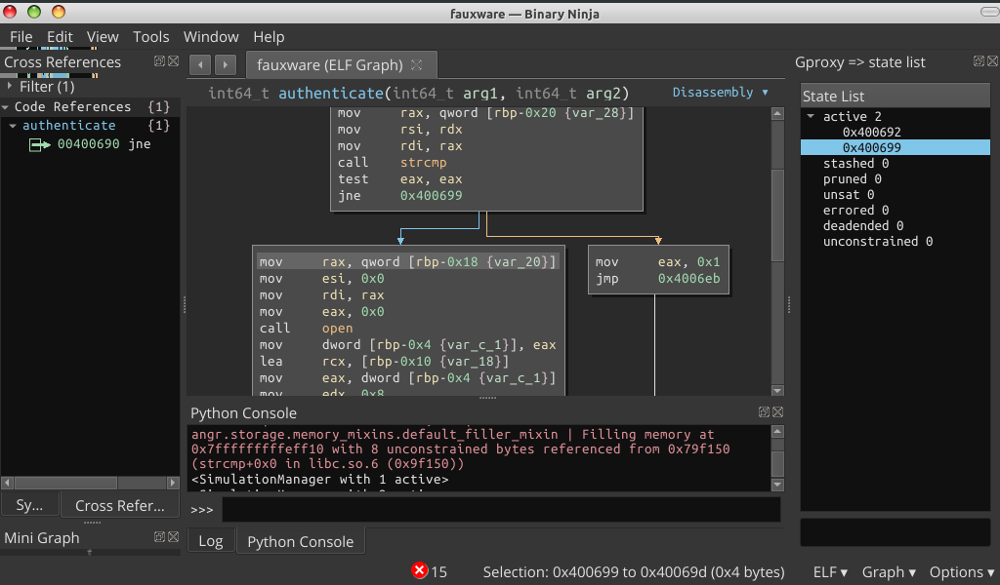

Bridge gdb, binaryninja and angr for binary analyses



Youtube Demo 1
[](https://m.youtube.com/watch?v=GSqoDsAwt-Y)

Youtube Demo 2 (real target)
[](https://m.youtube.com/watch?v=qLTcykEyN0I)


# Requirenment
```
binaryninja 2.0...
gdb 9
angr 9.2.102
```

# Usage
```
1). copy this directory in binaryninja plugin path
2). gdb ./a.out
    (gdb) source /gproxy/gdbinit.py
3). start server in binaryninja: Tools > gproxy > start server

mencocokan alamat gdb ke binaryninja
(gdb) b main
(gdb) run
(gdb) info proc mappings 
          Start Addr           End Addr       Size     Offset objfile
      0x555555554000 

4). binaryninja: file > rebase > 0x555555554000
```

# Tips
Start server setelah address di binaryninja di rebase.<br>

Menyamakan binaryninja dan angr:
```python

hex(state.project.loader.main_object.mapped_base)


```
ANGR baseaddress misal mengikuti GDB:
```python

proj = angr.Project(bv.file.filename, main_opts={'base_addr': 0x555555554000})
state = proj.factory.entry_state(stdin=angr.SimFile)

```


Test step state for branch
```python


import angr
proj = angr.Project(bv.file.filename)
state = proj.factory.entry_state(stdin=angr.SimFile)
simgr = proj.factory.simgr(state)
while len(simgr.active) == 1:
	simgr.step()


```

After import Angr and generate state in console paste this for UI consumer
```python


from gproxy.data_global import GLOBAL, SIGNALS

GLOBAL.simgr = simgr
SIGNALS.state_updated.emit()


```

# Cheatshet
Update realtime in UI
```python


import angr
from gproxy.data_global import GLOBAL, SIGNALS

proj = angr.Project(bv.file.filename)
state = proj.factory.entry_state(stdin=angr.SimFile)
simgr = proj.factory.simgr(state)
while len(simgr.active) == 1:
    simgr.step()
    GLOBAL.simgr = simgr
    SIGNALS.state_updated.emit()


```

Explore, this pararel step for active stash
```python

simgr.explore(find=0x123)
simgr.explore(find=0x123, avoid=0x777) #menghindari 0x777

#Mencari ketika input stdin menghasilkan password benar
simgr.epxpore(find=lambda s: b"Access granted" in s.posix.dumps(0) )

#Menghindari pesan kesalahan di stdout
simgr.explore(avoid=lambda s: b"Wrong password" in s.posix.dumps(1) )

#Brute force password
simgr.explore(find=lambda s: b"Success" in s.posix.dumps(1), avoid=lambda s: b"Fail" in s.posix.dumps(1) )

#show status explore
import logging
logging.getLogger('angr').setLevel('INFO')

#Note: dump(fd) 0=stdin 1=stdout 2=stderr

```

Symbion mode, sample packed_elf64 malware

```python

import subprocess
import os
import nose
import avatar2 as avatar2
import angr
import claripy
from angr_targets import AvatarGDBConcreteTarget
from gproxy.data_global import GLOBAL, SIGNALS

avatar_gdb = AvatarGDBConcreteTarget(avatar2.archs.X86_64, "127.0.0.1", 1234) #other terminal $ gdbserver :1234 ./packed_elf64
p = angr.Project(bv.file.filename, concrete_target=avatar_gdb, use_sim_procedures=True)

entry_state = p.factory.entry_state()
entry_state.options.add(angr.options.SYMBION_SYNC_CLE)
entry_state.options.add(angr.options.SYMBION_KEEP_STUBS_ON_SYNC)
simgr = p.factory.simgr(entry_state)

GLOBAL.simgr = simgr
SIGNALS.state_updated.emit()

simgr.use_technique(angr.exploration_techniques.Symbion(find=[0x85b853]))
exploration = simgr.run()

GLOBAL.simgr = simgr
SIGNALS.state_updated.emit()

new_concrete_state = exploration.stashes['found'][0]

for i in range(0,4):
     simgr = p.factory.simgr(new_concrete_state)
     simgr.use_technique(angr.exploration_techniques.Symbion(find=[0x85b853]))
     exploration = simgr.run()
     new_concrete_state = exploration.stashes['found'][0]

GLOBAL.simgr = simgr
SIGNALS.state_updated.emit()

simgr = p.factory.simgr(new_concrete_state)
simgr.use_technique(angr.exploration_techniques.Symbion(find=[0x400cd6]) )

exploration = simgr.run()
GLOBAL.simgr = simgr
SIGNALS.state_updated.emit()

# kode yang dikaburkan

state1 = simgr.found[0]
addr = state1.addr
data = state1.memory.load(addr, 0x100)
raw = state1.solver.eval(data, cast_to=bytes)

import capstone
from capstone import Cs, CS_ARCH_X86, CS_MODE_64
md = Cs(CS_ARCH_X86, CS_MODE_64)

for i in md.disasm(raw, addr):
    print("0x%x:\t%s\t%s" % (i.address, i.mnemonic, i.op_str))

# atau load ke binaryninja hasil raw
bv.add_user_segment(addr, len(raw), 0, len(raw), SegmentFlag.SegmentReadable | SegmentFlag.SegmentExecutable)
bv.write(addr, raw)
bv.add_function(addr)

```
